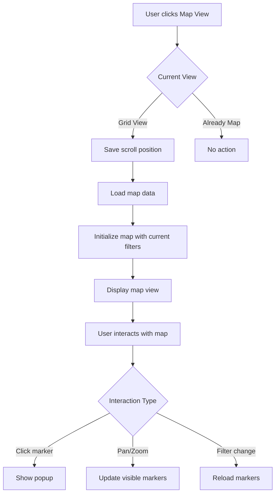

# Map View Integration - Architectural Design Document

## Executive Summary
This document outlines the architectural design for integrating an enhanced map view into the Architecture page, supporting seamless switching between list/grid and map views while maintaining high performance with 14,000+ buildings.

## 1. UI/UX Design for View Mode Switching

### 1.1 Toggle Interface
- **Location**: Top-right corner of page header, aligned with page title
- **Component**: Material-UI ToggleButtonGroup with two options:
  - Grid View (GridViewIcon) - Default
  - Map View (MapIcon)
- **Behavior**: 
  - Instant switching without page reload
  - Preserve current filters and search state
  - Show tooltips on hover
  - Save preference in localStorage

### 1.2 Visual Feedback
```typescript
interface ViewModeState {
  mode: 'grid' | 'map';
  transition: 'none' | 'switching';
  preserveScrollPosition: boolean;
}
```

### 1.3 Responsive Design
- Desktop: Toggle always visible
- Tablet: Toggle visible with compact icons
- Mobile: Toggle in header with optimized touch targets

## 2. Enhanced Map Component Architecture

### 2.1 Component Structure
```typescript
interface EnhancedMapProps {
  markers: MapMarker[];
  center?: [number, number];
  zoom?: number;
  height?: string;
  onMarkerClick?: (marker: MapMarker) => void;
  showClusters?: boolean;
  filters?: MapFilters;
  onBoundsChange?: (bounds: LatLngBounds) => void;
}

interface MapMarker {
  id: string | number;
  position: [number, number];
  title: string;
  architect?: string;
  year?: number;
  category?: string;
  tags?: string;
  address?: string;
  // Custom marker properties
  markerType?: 'default' | 'award' | 'featured';
  color?: string;
}

interface MapFilters {
  categories?: string[];
  yearRange?: [number, number];
  awards?: string[];
  architects?: string[];
}
```

### 2.2 Map Features
1. **Marker Clustering**: Group nearby markers at lower zoom levels
2. **Custom Markers**: Different icons/colors based on building category or awards
3. **Info Windows**: Rich popups with building details
4. **Heat Map Layer**: Optional density visualization
5. **Search Within Map**: Filter results based on visible area

### 2.3 Interaction Design
```typescript
// Marker click handler
const handleMarkerClick = (marker: MapMarker) => {
  // Show detailed popup
  setSelectedMarker(marker);
  
  // Optional: Update URL to enable direct linking
  updateURLParams({ selected: marker.id });
  
  // Track analytics event
  trackEvent('map_marker_click', { 
    buildingId: marker.id,
    category: marker.category 
  });
};

// Popup content
<MapPopup marker={selectedMarker}>
  <Box sx={{ p: 2, minWidth: 280 }}>
    <Typography variant="h6">{marker.title}</Typography>
    {marker.architect && (
      <Typography variant="body2" color="text.secondary">
        <PersonIcon fontSize="small" /> {marker.architect}
      </Typography>
    )}
    {marker.year && (
      <Typography variant="body2" color="text.secondary">
        <CalendarTodayIcon fontSize="small" /> {marker.year}年
      </Typography>
    )}
    <Button 
      component={RouterLink} 
      to={`/architecture/${marker.id}`}
      size="small"
      sx={{ mt: 1 }}
    >
      詳細を見る
    </Button>
  </Box>
</MapPopup>
```

## 3. Filter Synchronization Architecture

### 3.1 Unified Filter State
```typescript
interface UnifiedFilterState {
  // Common filters for both views
  searchQuery: string;
  selectedArchitect?: string;
  selectedCategory?: string;
  selectedPrefecture?: string;
  yearRange?: [number, number];
  selectedTags: string[];
  sortBy: 'year_desc' | 'year_asc' | 'name_asc';
  
  // View-specific state
  viewMode: 'grid' | 'map';
  
  // Grid-specific
  currentPage: number;
  itemsPerPage: number;
  
  // Map-specific
  mapBounds?: LatLngBounds;
  mapZoom?: number;
  mapCenter?: [number, number];
  showClusters: boolean;
}
```

### 3.2 State Management Pattern
```typescript
// Custom hook for filter management
const useArchitectureFilters = () => {
  const [filters, setFilters] = useState<UnifiedFilterState>(defaultFilters);
  const location = useLocation();
  const navigate = useNavigate();
  
  // Sync filters with URL
  useEffect(() => {
    const params = new URLSearchParams(location.search);
    const urlFilters = parseURLFilters(params);
    setFilters(prev => ({ ...prev, ...urlFilters }));
  }, [location.search]);
  
  // Update URL when filters change
  const updateFilters = useCallback((updates: Partial<UnifiedFilterState>) => {
    const newFilters = { ...filters, ...updates };
    setFilters(newFilters);
    
    // Update URL without page reload
    const params = buildURLParams(newFilters);
    navigate({ search: params.toString() }, { replace: true });
  }, [filters, navigate]);
  
  return { filters, updateFilters };
};
```

### 3.3 Filter Application Logic
```typescript
// Apply filters to both grid and map data
const applyFilters = (
  data: Architecture[], 
  filters: UnifiedFilterState
): Architecture[] => {
  let filtered = [...data];
  
  // Common filters
  if (filters.searchQuery) {
    filtered = filtered.filter(item => 
      item.title.includes(filters.searchQuery) ||
      item.architect?.includes(filters.searchQuery)
    );
  }
  
  if (filters.selectedCategory) {
    filtered = filtered.filter(item => 
      item.category === filters.selectedCategory
    );
  }
  
  // Map-specific: filter by bounds
  if (filters.viewMode === 'map' && filters.mapBounds) {
    filtered = filtered.filter(item => 
      item.latitude && item.longitude &&
      filters.mapBounds!.contains([item.latitude, item.longitude])
    );
  }
  
  return filtered;
};
```

## 4. Performance Optimization Strategy

### 4.1 Data Loading Optimization
```typescript
class OptimizedMapDataLoader {
  private cache = new Map<string, Architecture[]>();
  private clusterCache = new Map<string, ClusterData>();
  
  async loadMapData(options: {
    bounds?: LatLngBounds;
    zoom: number;
    filters: UnifiedFilterState;
  }): Promise<MapDataResult> {
    const cacheKey = this.getCacheKey(options);
    
    // Check cache first
    if (this.cache.has(cacheKey)) {
      return {
        markers: this.cache.get(cacheKey)!,
        clusters: this.getOrCreateClusters(cacheKey, options.zoom)
      };
    }
    
    // Progressive loading based on zoom level
    if (options.zoom < 8) {
      // Load aggregated data for low zoom
      return this.loadAggregatedData(options);
    } else if (options.zoom < 12) {
      // Load regional data
      return this.loadRegionalData(options);
    } else {
      // Load detailed data for high zoom
      return this.loadDetailedData(options);
    }
  }
  
  private async loadAggregatedData(options: LoadOptions): Promise<MapDataResult> {
    // Load pre-computed clusters from server
    const response = await fetch('/api/map/clusters', {
      method: 'POST',
      body: JSON.stringify({
        zoom: options.zoom,
        bounds: options.bounds,
        filters: options.filters
      })
    });
    
    return response.json();
  }
}
```

### 4.2 Rendering Optimization
```typescript
// React component with performance optimizations
const OptimizedMapView = React.memo(({ 
  data, 
  filters, 
  onBoundsChange 
}: MapViewProps) => {
  // Debounce bounds changes to prevent excessive re-renders
  const debouncedBoundsChange = useMemo(
    () => debounce(onBoundsChange, 300),
    [onBoundsChange]
  );
  
  // Memoize marker creation
  const markers = useMemo(() => {
    return data
      .filter(item => item.latitude && item.longitude)
      .map(item => createMapMarker(item));
  }, [data]);
  
  // Use virtualization for marker rendering
  const visibleMarkers = useVirtualizedMarkers(markers, {
    bounds: mapBounds,
    maxMarkers: 1000
  });
  
  return (
    <MapContainer
      style={{ height: '600px' }}
      onBoundsChange={debouncedBoundsChange}
    >
      <MarkerClusterGroup
        showCoverageOnHover={false}
        maxClusterRadius={50}
        chunkedLoading
      >
        {visibleMarkers.map(marker => (
          <OptimizedMarker 
            key={marker.id} 
            marker={marker}
          />
        ))}
      </MarkerClusterGroup>
    </MapContainer>
  );
});
```

### 4.3 Memory Management
```typescript
class MapMemoryManager {
  private maxCacheSize = 50 * 1024 * 1024; // 50MB
  private currentSize = 0;
  
  addToCache(key: string, data: any): void {
    const size = this.getObjectSize(data);
    
    // Evict old entries if cache is full
    while (this.currentSize + size > this.maxCacheSize) {
      this.evictOldest();
    }
    
    this.cache.set(key, {
      data,
      size,
      timestamp: Date.now()
    });
    
    this.currentSize += size;
  }
  
  // Clean up when switching views
  cleanup(): void {
    // Remove non-essential cached data
    this.cache.forEach((value, key) => {
      if (!this.isEssential(key)) {
        this.cache.delete(key);
        this.currentSize -= value.size;
      }
    });
  }
}
```

## 5. User Interaction Flow

### 5.1 View Switching Flow


### 5.2 Filter Interaction Flow
1. **User applies filter in grid view**
   - Filter state updates
   - URL updates
   - Grid refreshes

2. **User switches to map view**
   - Filters persist
   - Map loads with filtered markers
   - Appropriate zoom level set

3. **User applies filter in map view**
   - Map markers update
   - Clusters recalculate
   - URL updates

### 5.3 Performance Considerations
- **Lazy Loading**: Load map library only when map view is selected
- **Progressive Enhancement**: Show basic markers first, enhance with details
- **Throttling**: Limit API calls during rapid interactions
- **Caching**: Cache filtered results for quick view switching

## 6. Implementation Phases

### Phase 1: Basic Map Integration (Week 1)
- [ ] Add view toggle UI
- [ ] Integrate basic map component
- [ ] Implement marker display
- [ ] Basic popup functionality

### Phase 2: Filter Synchronization (Week 2)
- [ ] Unified filter state management
- [ ] URL synchronization
- [ ] Filter persistence across views
- [ ] Map bounds filtering

### Phase 3: Performance Optimization (Week 3)
- [ ] Implement marker clustering
- [ ] Add data virtualization
- [ ] Optimize loading strategies
- [ ] Memory management

### Phase 4: Enhanced Features (Week 4)
- [ ] Custom marker icons
- [ ] Heat map visualization
- [ ] Advanced popups
- [ ] Analytics integration

## 7. Testing Strategy

### 7.1 Unit Tests
```typescript
describe('MapView Integration', () => {
  test('should switch between grid and map views', async () => {
    const { getByRole, queryByTestId } = render(<ArchitecturePage />);
    
    // Initially in grid view
    expect(queryByTestId('map-container')).not.toBeInTheDocument();
    
    // Switch to map view
    fireEvent.click(getByRole('button', { name: /map view/i }));
    
    // Map should be visible
    await waitFor(() => {
      expect(queryByTestId('map-container')).toBeInTheDocument();
    });
  });
  
  test('should preserve filters when switching views', async () => {
    // Test filter persistence logic
  });
});
```

### 7.2 Performance Tests
- Load time with 14,000 markers
- Memory usage monitoring
- Frame rate during interactions
- API call optimization

### 7.3 E2E Tests
- Complete user workflows
- Cross-browser compatibility
- Mobile responsiveness
- Error handling

## 8. Monitoring and Analytics

### 8.1 Performance Metrics
```typescript
// Track map performance
const trackMapPerformance = () => {
  // Initial load time
  performance.mark('map-load-start');
  // After markers rendered
  performance.mark('map-load-end');
  
  const measure = performance.measure(
    'map-load-time',
    'map-load-start',
    'map-load-end'
  );
  
  analytics.track('map_performance', {
    loadTime: measure.duration,
    markerCount: visibleMarkers.length,
    viewportSize: getViewportSize()
  });
};
```

### 8.2 User Behavior Analytics
- View mode preferences
- Filter usage patterns
- Map interaction heatmap
- Performance bottlenecks

## 9. Future Enhancements

### 9.1 Advanced Visualizations
- 3D building models
- Time-based animations
- AR view integration
- Street view integration

### 9.2 Collaboration Features
- Share map views
- Collaborative filtering
- Saved searches
- Custom map layers

### 9.3 AI-Powered Features
- Smart clustering based on similarity
- Predictive loading
- Personalized recommendations
- Natural language search

## Conclusion

This architectural design provides a comprehensive approach to integrating map view into the Architecture page. The design prioritizes performance, user experience, and maintainability while ensuring seamless integration with existing functionality.

Key success factors:
- Smooth transition between views
- Consistent filter behavior
- Optimal performance with large datasets
- Intuitive user interactions
- Progressive enhancement approach

The phased implementation allows for iterative development and testing, ensuring each component is thoroughly validated before moving to the next phase.